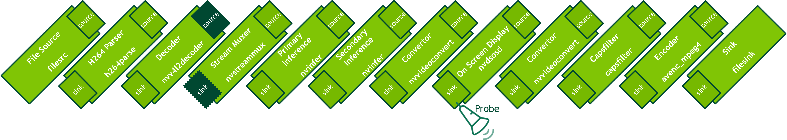

### 🎯 **Overview:**
DeepStream pipelines can be constructed to perform complex analytics that involve multiple neural networks. One common use case for this would be to use a detector as a primary inference engine to localize an object and a classifier as a secondary inference engine. For deep learning inference, I used a pre-trained model that is available on [NVIDIA GPU Cloud](https://catalog.ngc.nvidia.com/), the hub for GPU-optimized AI and high-performance computing (HPC) software. NGC offers pre-trained models for many AI tasks.

In this project, I used two purpose-built models from NGC - the [TrafficCamNet](https://catalog.ngc.nvidia.com/orgs/nvidia/teams/tao/models/trafficcamnet) object detection model which detects four categories of objects (car, persons, road signs and two-wheelers) and the [VehicleTypeNet](https://catalog.ngc.nvidia.com/orgs/nvidia/teams/tao/models/vehicletypenet) classification model which detects 6 classes of objects (coupe, sedan, SUV, van, large vehicle, truck).

The deepstream pipeline architecture of the application is shown in the image below. We'll be using an object detection network to identify and localize the cars in the frames, followed by a secondary inference to classify vehicle types belonging to one of 6 classes (coupe, sedan, SUV, van, large vehicle, truck).

---

### 🧰 **Tools:**

  &nbsp;
  &nbsp;
  &nbsp;
  

---
### 🛠️ **Libraries Used:**
  * [Nvidia DeepStream Sdk](https://docs.nvidia.com/metropolis/deepstream/dev-guide/text/DS_Quickstart.html): NVIDIA® DeepStream Software Development Kit (SDK) is an accelerated AI framework to build intelligent video analytics (IVA) pipelines
  * [Gstreamer](https://gstreamer.freedesktop.org/documentation/application-development/introduction/gstreamer.html?gi-language=c): GStreamer is a framework for      creating streaming media applications.
  * [FFmpeg](https://ffmpeg.org): A complete, cross-platform solution to record, convert and stream audio and video.

---

### 📔 **Note:**
  * DeepStream runs on NVIDIA® T4, NVIDIA® Ampere and platforms such as NVIDIA® Jetson™ Nano, NVIDIA® Jetson AGX Xavier™, NVIDIA® Jetson Xavier NX™, NVIDIA® Jetson™ TX1 and TX2., so in other to run the code, use any of these platforms or Nvidia's cloud platform!

